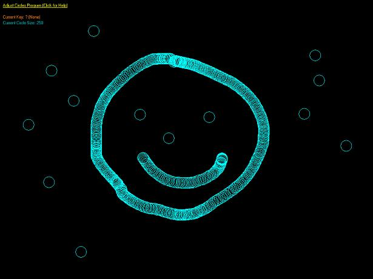



## Adjust Circles v1\.0

### Description

This code allows you to adjust the size of a circle. It also lets you draw on screen, place circles anywhere, and drag circles in full screen with your mouse. This is PUR VB code. No DirectX or OpenGL used. It is mainly for beginners to show them how to do this stuff and plus i wrote it when I was bored too lol. If you like the code then please leave comments and vote for me. Thanks! :)
 
### More Info
 

             |
---                |---
**Submitted On**   |2007-04-21 22:36:46
**By**             |[Ryan33](https://github.com/Planet-Source-Code/PSCIndex/blob/master/ByAuthor/ryan33.md)
**Level**          |Beginner
**User Rating**    |4.0 (8 globes from 2 users)
**Compatibility**  |VB 6\.0
**Category**       |[Miscellaneous](https://github.com/Planet-Source-Code/PSCIndex/blob/master/ByCategory/miscellaneous__1-1.md)
**World**          |[Visual Basic](https://github.com/Planet-Source-Code/PSCIndex/blob/master/ByWorld/visual-basic.md)
**Archive File**   |[Adjust\_Cir2061584222007\.zip](https://github.com/Planet-Source-Code/ryan33-adjust-circles-v1-0__1-68412/archive/master.zip)

